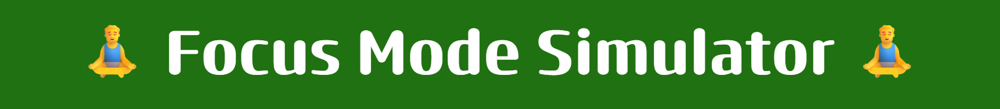
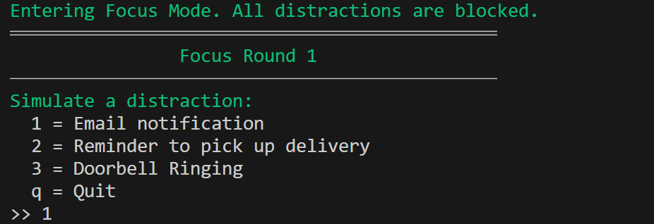
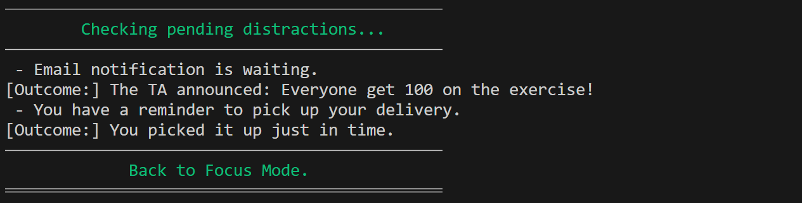

# Focus Mode Simulator 🧘‍♂️  

⏱️ C program that simulates focused work sessions while handling distractions using Unix signals

## Table of Contents  

1. [About](#about)  
2. [Features](#features)  
3. [Requirements](#requirements)  
4. [Installation](#installation)  
5. [Usage](#usage)  

---

## About

The **Focus Mode Simulator** is a C program that simulates a productivity-focused session while handling common distractions.  
Users experience a "focus mode" where certain distractions (email, delivery reminders, doorbell) are temporarily blocked.  

The project demonstrates **signal handling (SIGUSR1, SIGUSR2, SIGALRM)**, **process control**, and **user interaction via terminal input**.  

---

## Features

- Simulates a focus session with multiple rounds  
- Blocks distractions such as email notifications, delivery reminders, and doorbell ringing  
- Allows users to simulate distractions manually during a round  
- Displays outcomes of distractions after each round  
- Uses signal handling (`SIGUSR1`, `SIGUSR2`, `SIGALRM`) to manage distractions  

---

## Requirements

- A Linux, macOS, or Windows system with WSL for running C programs  
- GCC (GNU Compiler Collection) 
- Git (to clone the repository)  
- Make (to build the project)  

---

## Installation

Follow these steps to set up the project locally:

---

### 1. Clone the repository
```bash
git clone https://github.com/Amit-Bruhim/FocusMode-Simulator.git
```

### 2. Compile and Run the program using Make
```bash
make run
```

---

## Usage

When you run the **Focus Mode Simulator**, each round begins by displaying a header indicating the start of the focus round.  

The program then presents a menu for the user to simulate distractions:  

  

- `1` = Email notification  
- `2` = Reminder to pick up delivery  
- `3` = Doorbell ringing  
- `q` = Quit the current round 

After the user completes a round (either by entering `q` or reaching the end of the round duration), the program displays which distractions were pending during that round:  

  

This process repeats for the specified number of rounds.  

> For user convenience, the default run uses `2 2` (2 rounds, 2 inputs per round), but you can change these values when running the program.


